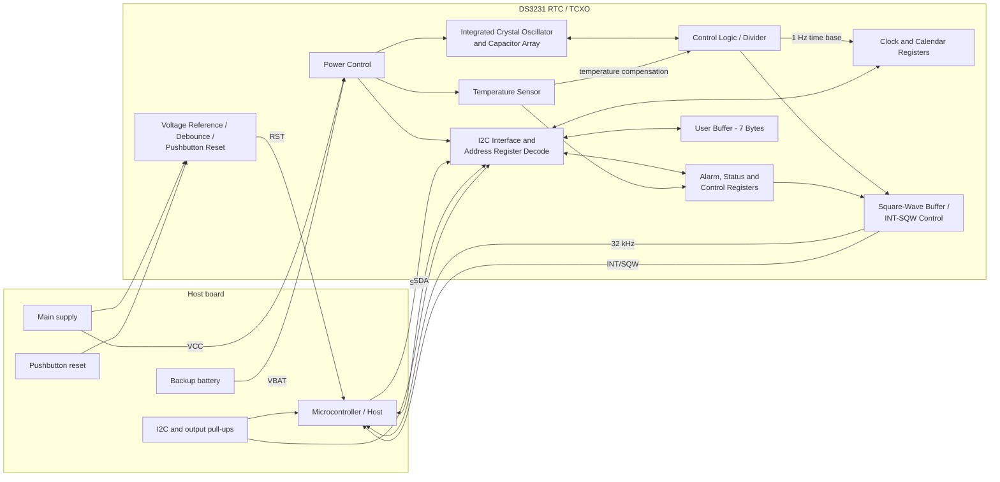
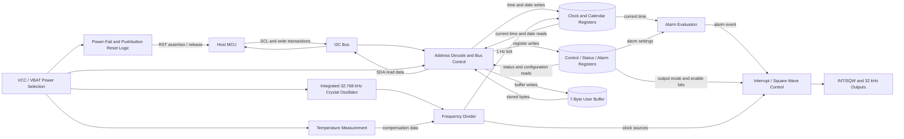
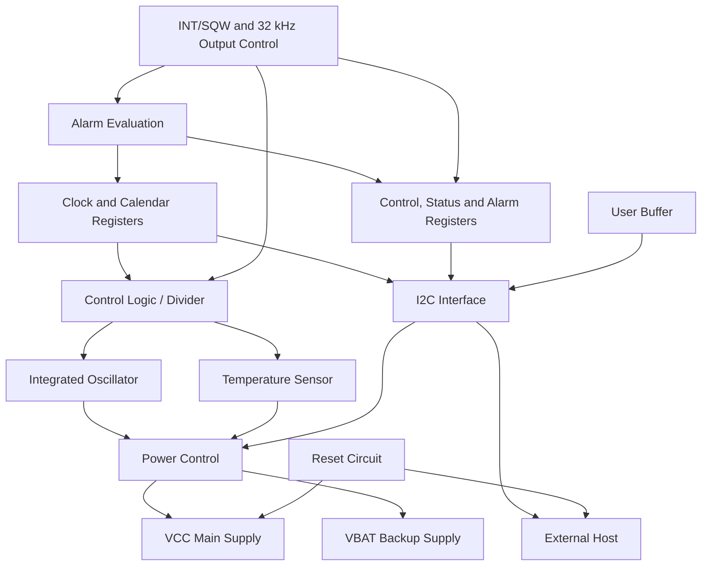

# DS3231 Agent-Friendly Hardware Specification

## 1. Document metadata

| Field | Extracted value |
|---|---|
| Device | DS3231 |
| Manufacturer | Maxim Integrated |
| Title | Extremely Accurate I2C-Integrated RTC/TCXO/Crystal |
| Revision | 19-5170; Rev 10; 3/15 |
| Package described | 16-pin, 300-mil SO |
| Uploaded pages | 6 |
| Printed datasheet pages present | 1, 2, 3, 6, 7, 8 |
| Missing from supplied extract | Printed pages 4 and 5 |

> **Extraction warning:** This PDF is not the complete datasheet. The missing pages may contain register maps, pin numbering or timing tables needed for a complete implementation specification.

## 2. Functional summary

The DS3231 is a real-time clock with an integrated temperature-compensated crystal oscillator and integrated crystal resonator. It keeps time using either the main VCC supply or a VBAT backup source. The device communicates through a bidirectional I2C bus and includes calendar logic, two alarms, programmable square-wave outputs, a digital temperature sensor and reset supervision.

### Timekeeping behavior

- Counts seconds, minutes, hours, day of week, date, month and year.
- Automatically handles months with fewer than 31 days.
- Provides leap-year correction through 2100.
- Supports 12-hour mode with AM/PM and 24-hour mode.
- Provides two programmable time-of-day alarms.

### Applications

- Servers
- Telematics
- Utility power meters
- GPS

## 3. Key capabilities

| Capability | Normalized specification | Source PDF page |
|---|---|---:|
| Commercial frequency accuracy | +/-2 ppm from 0 C to +40 C | 1, 3 |
| Industrial frequency accuracy | +/-3.5 ppm from -40 C to +85 C | 1, 3 |
| Temperature sensor accuracy | -3 C to +3 C | 1, 3 |
| I2C speed | Up to 400 kHz | 1, 4 |
| Backup timekeeping | Maintains time when VCC is interrupted | 1 |
| Calendar validity | Leap-year compensation through 2100 | 1 |
| Alarms | Two time-of-day alarms | 1 |
| Outputs | INT/SQW and 32 kHz | 1, 6 |
| Reset | Power-fail RST output and debounced pushbutton input | 1, 6 |

## 4. External interfaces

| Signal | Direction/type | Function | Source PDF page |
|---|---|---|---:|
| VCC | Power input | Primary supply | 1, 6 |
| VBAT | Power input | Backup timekeeping supply | 1, 6 |
| GND | Power return | Ground reference | 1, 6 |
| SCL | Input | I2C serial clock, up to 400 kHz | 1, 4, 6 |
| SDA | Bidirectional, open-drain | I2C serial data | 1, 4, 6 |
| INT/SQW | Open-drain output | Alarm interrupt or programmable square wave | 1, 2, 6 |
| 32kHz | Open-drain output | 32.768 kHz clock output | 1, 2, 6 |
| RST | Open-drain output and monitored input | Reset supervision and pushbutton reset | 1, 2, 6 |
| N.C. | Not connected | Multiple package positions; exact pin numbering not present in extract | 1 |

### Typical board-level connections

- SCL and SDA use pull-up resistors to VCC.
- The datasheet shows pull-up sizing as `RPU = tR / CB`.
- INT/SQW and 32kHz are shown with pull-ups to VCC.
- VBAT connects to a backup cell.
- RST may be connected to a pushbutton to ground.
- A VCC decoupling capacitor is shown.

## 5. Absolute maximum ratings

| Parameter | Minimum | Maximum | Unit | Source PDF page |
|---|---:|---:|---|---:|
| Voltage on any pin relative to ground | -0.3 | +6.0 | V | 2 |
| Junction-to-ambient thermal resistance, theta_JA | - | 73 | C/W | 2 |
| Junction-to-case thermal resistance, theta_JC | - | 23 | C/W | 2 |
| Operating temperature, DS3231S | 0 | +70 | C | 2 |
| Operating temperature, DS3231SN | -40 | +85 | C | 2 |
| Junction temperature | - | +125 | C | 2 |
| Storage temperature | -40 | +85 | C | 2 |
| Lead temperature, 10 s soldering | - | +260 | C | 2 |
| Reflow temperature, two times maximum | - | +260 | C | 2 |

## 6. Recommended operating conditions

| Parameter | Symbol | Minimum | Typical | Maximum | Unit | Source PDF page |
|---|---|---:|---:|---:|---|---:|
| Main supply voltage | VCC | 2.3 | 3.3 | 5.5 | V | 2 |
| Backup supply voltage | VBAT | 2.3 | 3.0 | 5.5 | V | 2 |
| Logic-1 input, SDA/SCL | VIH | 0.7 x VCC | - | VCC + 0.3 | V | 2 |
| Logic-0 input, SDA/SCL | VIL | -0.3 | - | 0.3 x VCC | V | 2 |

## 7. Electrical characteristics - VCC operation

Unless otherwise noted: VCC = 2.3 V to 5.5 V, VCC is the active supply, and TA = TMIN to TMAX. Typical values are at VCC = 3.3 V, VBAT = 3.0 V and TA = +25 C.

| Parameter | Symbol | Conditions | Min | Typ | Max | Unit |
|---|---|---|---:|---:|---:|---|
| Active supply current | ICCA | VCC = 3.63 V; Notes 4, 5 | - | - | 200 | uA |
| Active supply current | ICCA | VCC = 5.5 V; Notes 4, 5 | - | - | 300 | uA |
| Standby supply current | ICCS | I2C inactive, 32kHz on, SQW off; VCC = 3.63 V | - | - | 110 | uA |
| Standby supply current | ICCS | I2C inactive, 32kHz on, SQW off; VCC = 5.5 V | - | - | 170 | uA |
| Temperature conversion current | ICCSCONV | I2C inactive, 32kHz on, SQW off; VCC = 3.63 V | - | - | 575 | uA |
| Temperature conversion current | ICCSCONV | I2C inactive, 32kHz on, SQW off; VCC = 5.5 V | - | - | 650 | uA |
| Power-fail voltage | VPF | - | 2.45 | 2.575 | 2.70 | V |
| Logic-0 output, 32kHz/INT-SQW/SDA | VOL | IOL = 3 mA | - | - | 0.4 | V |
| Logic-0 output, RST | VOL | IOL = 1 mA | - | - | 0.4 | V |
| Output leakage, 32kHz/INT-SQW/SDA | ILO | High impedance | -1 | 0 | +1 | uA |
| Input leakage, SCL | ILI | - | -1 | - | +1 | uA |
| RST pin I/O leakage | IOL | RST high impedance | -200 | - | +10 | uA |
| VBAT leakage with VCC active | IBATLKG | - | - | 25 | 100 | nA |

## 8. Frequency and temperature characteristics

| Parameter | Symbol | Conditions | Extracted value | Unit |
|---|---|---|---:|---|
| Output frequency | fOUT | VCC = 3.3 V or VBAT = 3.3 V | 32.768 typical | kHz |
| Commercial stability | delta_f/fOUT | 0 C to +40 C; aging offset 00h | +/-2 max | ppm |
| Commercial stability | delta_f/fOUT | >+40 C to +70 C; aging offset 00h | +/-3.5 max | ppm |
| Industrial stability | delta_f/fOUT | -40 C to <0 C; aging offset 00h | +/-3.5 max | ppm |
| Industrial stability | delta_f/fOUT | 0 C to +40 C; aging offset 00h | +/-2 max | ppm |
| Industrial stability | delta_f/fOUT | >+40 C to +85 C; aging offset 00h | +/-3.5 max | ppm |
| Stability vs voltage | delta_f/V | - | 1 typical | ppm/V |
| Trim sensitivity per LSB | delta_f/LSB | -40 C | 0.7 typical | ppm |
| Trim sensitivity per LSB | delta_f/LSB | +25 C | 0.1 typical | ppm |
| Trim sensitivity per LSB | delta_f/LSB | +70 C | 0.4 typical | ppm |
| Trim sensitivity per LSB | delta_f/LSB | +85 C | 0.8 typical | ppm |
| Temperature accuracy | Temp | VCC or VBAT = 3.3 V | -3 to +3 | C |
| Crystal aging | delta_f/fO | First year after reflow | +/-1.0 max | ppm |
| Crystal aging | delta_f/fO | 0-10 years after reflow | +/-5.0 max | ppm |

## 9. Electrical characteristics - VBAT operation

Conditions: VCC = 0 V, VBAT = 2.3 V to 5.5 V and TA = TMIN to TMAX unless otherwise noted.

| Parameter | Symbol | Conditions | Supply | Min | Typ | Max | Unit |
|---|---|---|---|---:|---:|---:|---|
| Active battery current | IBATA | EOSC=0, BBSQW=0, SCL=400 kHz | VBAT = 3.63 V | - | - | 70 | uA |
| Active battery current | IBATA | EOSC=0, BBSQW=0, SCL=400 kHz | VBAT = 5.5 V | - | - | 150 | uA |
| Timekeeping battery current | IBATT | EOSC=0, BBSQW=0, EN32kHz=1, SCL=SDA=0 V or VBAT | VBAT = 3.63 V | - | 0.84 | 3.0 | uA |
| Timekeeping battery current | IBATT | Same | VBAT = 5.5 V | - | 1.0 | 3.5 | uA |
| Temperature conversion current | IBATTC | EOSC=0, BBSQW=0, SCL=SDA=0 V or VBAT | VBAT = 3.63 V | - | - | 575 | uA |
| Temperature conversion current | IBATTC | Same | VBAT = 5.5 V | - | - | 650 | uA |
| Data-retention current | IBATTDR | EOSC=1, SCL=SDA=0 V, +25 C | - | - | - | 100 | nA |

## 10. I2C timing-diagram extraction

The supplied page contains a timing waveform but not the associated numeric timing table.

### Signals and events

- Signals: SDA and SCL
- Events: START, repeated START and STOP
- Timing labels: `tHD:STA`, `tLOW`, `tHIGH`, `tR`, `tF`, `tBUF`, `tHD:DAT`, `tSU:DAT`, `tSU:STA`, `tSU:STO`, `tSP`

### Extracted constraints from notes

- Negative undershoots below -0.3 V during battery-backed operation may cause data loss.
- SCL active clocking can be 400 kHz.
- The RST pin has an internal nominal 50 kohm pull-up to VCC.
- The device must internally provide at least 300 ns SDA hold time.
- Fast-mode operation in a standard-mode system requires `tSU:DAT >= 250 ns`.
- `CB` means total capacitance of one bus line in pF.

## 11. Typical operating-characteristic charts

| Chart | Inputs/series | Extracted semantic trend | Source PDF page |
|---|---|---|---:|
| Standby supply current vs supply voltage | VCC and ICCS | Current rises with VCC; a transition is shown near RST activation | 5 |
| Battery current vs supply voltage | VBAT, IBAT, EN32kHz 0/1 | Current rises with VBAT; enabling 32kHz increases current | 5 |
| Battery current vs temperature | Temperature and IBAT | Current rises with temperature | 5 |
| Frequency deviation vs temperature and aging value | Aging values 127, 32, 0, -33, -128 | Aging register shifts the frequency-deviation curves | 5 |
| Delta time/frequency vs temperature | DS3231 band and uncompensated crystal envelopes | TCXO accuracy band is much narrower than uncompensated crystal behavior | 5 |

> Curves were not numerically digitized. The output preserves chart titles, axes, series and qualitative relationships only.

## 12. Functional hierarchy

```text
DS3231
├── Power and supervision
│   ├── Power Control
│   └── Voltage Reference / Debounce / Pushbutton Reset
├── Time-base generation
│   ├── Integrated Crystal Oscillator and Capacitor Array
│   ├── Temperature Sensor
│   └── Control Logic / Divider
├── Digital interface and storage
│   ├── I2C Interface and Address Register Decode
│   ├── Clock and Calendar Registers
│   ├── Alarm, Status and Control Registers
│   └── User Buffer - 7 bytes
└── Outputs
    └── Square-Wave Buffer / INT-SQW Control
        ├── 32kHz
        └── INT/SQW
```

## 13. Mermaid architecture diagram



## 14. Mermaid data-flow diagram



## 15. Mermaid dependency graph



## 16. Extracted relationships

| Source | Relationship | Target | Evidence | Confidence |
|---|---|---|---|---|
| VCC / VBAT | feed | Power Control | Block-diagram input arrows | High |
| Power Control | powers | Oscillator, Temperature Sensor and I2C Interface | Block-diagram arrows | High |
| Oscillator | exchanges clock/control with | Control Logic / Divider | Bidirectional block-diagram arrow | High |
| Temperature Sensor | provides compensation input to | Control Logic / Divider | Block diagram plus TCXO description | High |
| Control Logic / Divider | provides 1 Hz time base to | Clock and Calendar Registers | 1 Hz label and RTC behavior | High |
| I2C Interface | reads/writes | Clock, control/alarm registers and user buffer | Block diagram and serial-interface text | High |
| Control/Alarm Registers | configure | INT/SQW Control | Vertical block-diagram connection | High |
| INT/SQW Control | drives | INT/SQW and 32kHz | Output arrows | High |
| Reset Circuit | drives | RST | Output arrow | High |

## 17. Machine-consumable output map

| File | Purpose |
|---|---|
| `canonical_spec.json` | Canonical structured representation for AI agents |
| `electrical_characteristics.csv` | Flat table suitable for validation and analytics |
| `relationships.csv` | Normalized component and signal relationships |
| `architecture.mmd` | Mermaid component architecture |
| `data_flow.mmd` | Mermaid data-flow diagram |
| `dependency_graph.mmd` | Mermaid dependency graph |
| `extraction_report.json` | Coverage, confidence and warnings |

## 18. Validation and limitations

- Narrative text, tables and block labels were checked against rendered PDF pages.
- Printed pages 4 and 5 are missing from the uploaded extract.
- Exact pin numbering and register-address maps are therefore not available.
- Numeric I2C timing limits are unavailable because the associated table is absent.
- Chart curves were not digitized into numeric samples.
- All facts include source-page references in the JSON representation.
